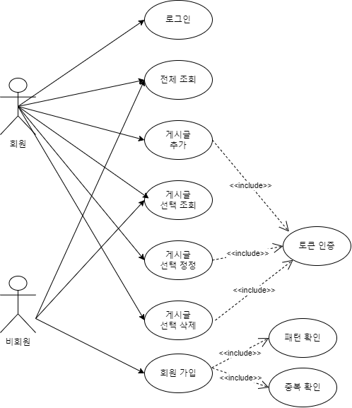
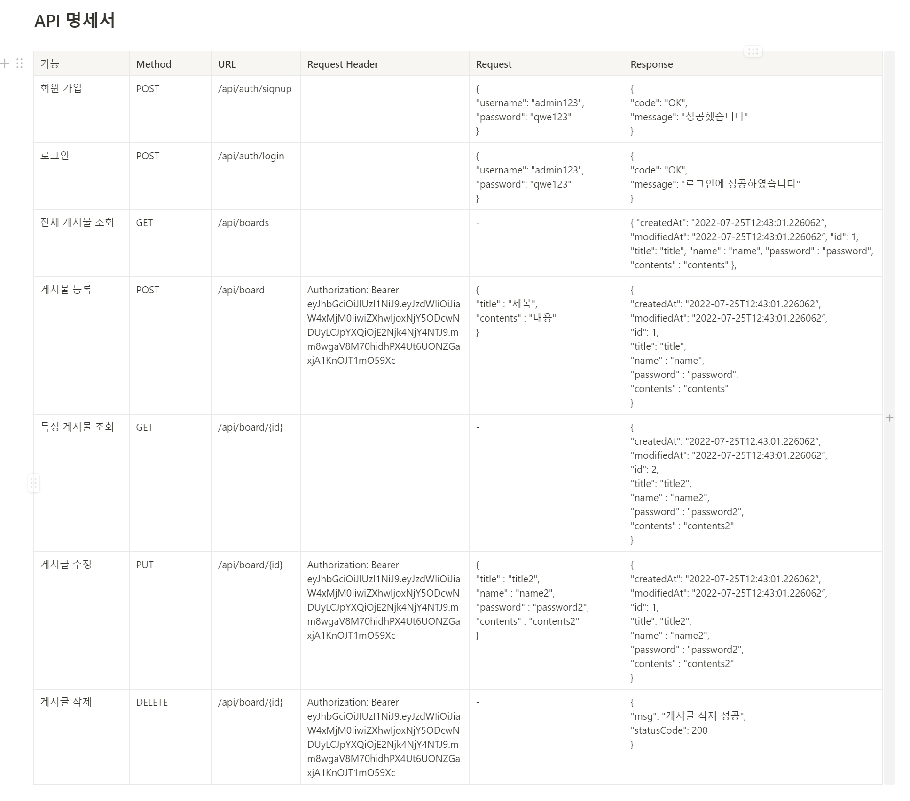
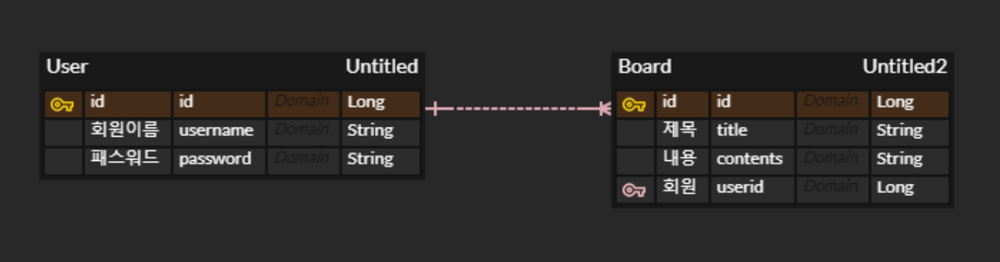

# Spring_Homework_4_Security

Spring 3주차 개인 과제
=====================

## 추가 요구 사항

1. 회원 가입 API
    - 회원 권한 부여하기 (ADMIN, USER) - ADMIN 회원은 모든 게시글 수정 / 삭제 가능
2. 게시글 작성 API
    - Spring Security를 사용하여 토큰 검사 및 인증하기!
3. 선택한 게시글 정정 API
    - Spring Security를 사용하여 토큰 검사 및 인증하기!
4. 선택한 게시글 삭제 API
    - Spring Security를 사용하여 토큰 검사 및 인증하기!

## UseCase

---

## API 명세서

---

## ERD 

---

---

## 질문

---

1. Spring Security를 적용했을 때 어떤 점이 도움이 되셨나요?
    1. 서비스 로직에서 처리해야 할 모듈 크기(코드 길이)가 단순화되고, 객체지향적으로 분리되어 인증/인가를 완전히 분리할 수 있었다. 또한 보안 부분이 분리돼 많은 작업을 독립적으로 수행할 수 있어 많은 기능 추가에 대한 가능성을 확인하였습니다.
2. IoC / DI 에 대해 간략하게 설명해 주세요!  - 숙련주차의 답변을 Upgrade 해 주세요!
    1. DI = 한 객체가 어떤 객체(구체 클래스)에 의존할 것인지는 별도의 관심사이다. Spring은 의존성 주입을 도와주는 DI 컨테이너로써, 강하게 결합된 클래스들을 분리하고, 애플리케이션 실행 시점에 객체 간의 관계를 결정해 줌으로써 결합도를 낮추고 유연성을 확보해준다. 이러한 방법은 상속보다 훨씬 유연하다. 단, 한 객체가 다른 객체를 주입받으려면 반드시 DI 컨테이너에 의해 관리되어야 한다는 것이다
    2. IoC = **스프링이 모든 의존성 객체를 스프링이 실행될때 다 만들어주고 필요한곳에 주입**시켜줌으로써 **Bean들은 `싱글턴 패턴`의 특징**을 가지며, **제어의 흐름을 사용자가 컨트롤 하는 것이 아니라 스프링에게 맡겨 작업을 처리**하게 된다.
3. JWT를 사용하여 인증/인가를 구현 했을 때의 장점은 무엇일까요? - 숙련주차의 답변을 Upgrade 해 주세요!
    - **임시 액세스를 자주 허용하는 관리자.** 날짜, 시간 또는 특별 이벤트에 따라 사용자 수의 변동 폭이 크면 액세스를 반복해서 허용 또는 취소하느라 쉽게 지칠 수 있습니다. 이때는 토큰이 유용합니다.
        
        예를 들어 대학 도서관 사이트의 관리자라면 아마 토큰 접근법의 진가를 알아볼 것입니다.
        
    - **액세스 세분화가 필요한 관리자.** 서버가 사용자 속성이 아닌 특정 문서 속성에 따라 액세스를 허용합니다. 하지만 비밀번호로는 정밀한 세분화가 어렵습니다.
        
        예를 들어 온라인 저널을 운영한다고 가정했을 때, 모든 독자가 여러 문서가 아닌 한 문서에서 저널을 읽고 댓글을 달 수 있도록 만들려고 합니다. 이때 토큰을 사용하면 가능합니다.
        
    - **주요 해킹 표적인 관리자.** 유출될 경우 기업에게 심각한 피해를 입힐 정도로 중요한 문서가 서버에 저장되어 있습니다. 비밀번호로만으로는 충분히 보호하기 어렵습니다. 이때는 하드웨어가 큰 도움이 될 수 있습니다.
4. 반대로 JWT를 사용한 인증/인가의 한계점은 무엇일까요? - 숙련주차의 답변을 Upgrade 해 주세요!
    1. JWT는 토큰의 상태를 저장하지 않습니다. Stateless 이 특성 때문에 한번 만들어진 토큰을 제어할 수 없다는 단점이 있어요. 임의로 삭제할 수 없으니 만료시간이 중요한데, 이를 길게 하면 데이터나 보안이 취약해지고, 짧게 하자니 로그인을 자주 해야 하는 문제가 발생합니다. 이에 대한 대안으로 refresh token, sliding session이 많이 사용되고 있습니다.